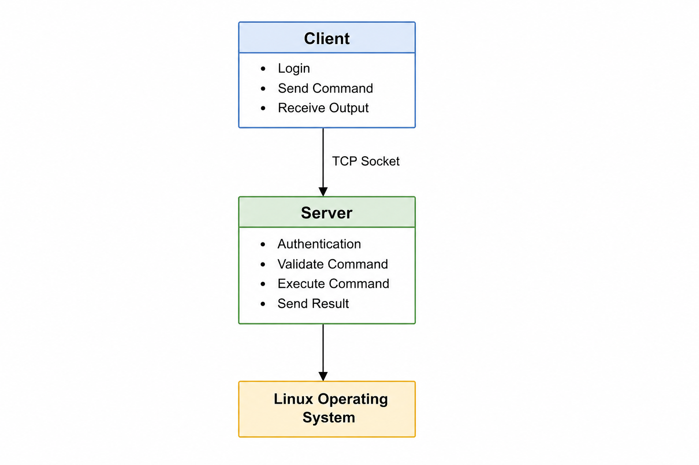
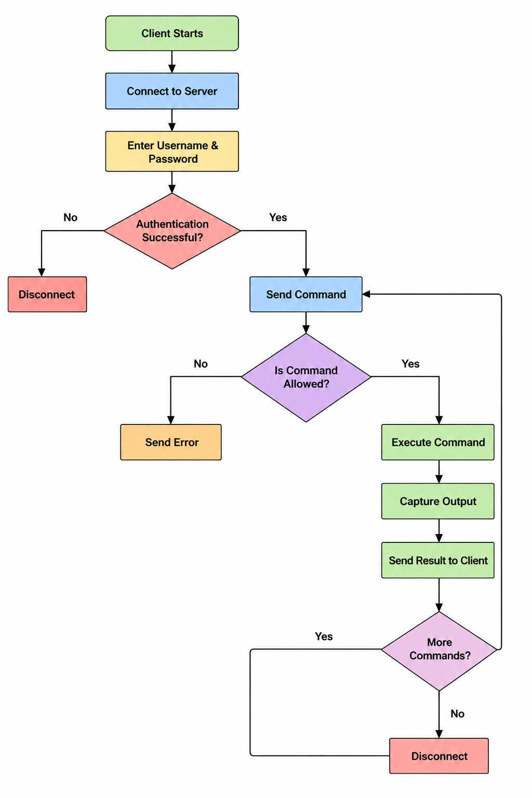
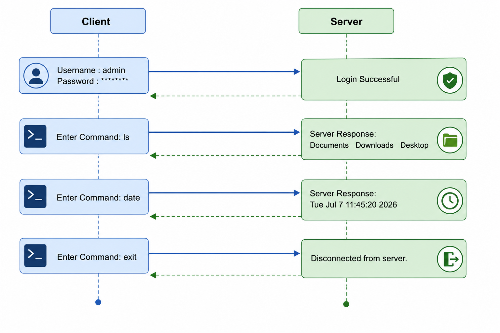

# 🚀 Remote Command Execution System

> **Network Programming Course Project**
> **Department of Software Engineering**
> **Nepal College of Information Technology (NCIT)**

---

# 📖 Project Overview

The **Remote Command Execution System** is a **TCP client-server application** developed in **C** using **socket programming**. The client securely connects to the server, authenticates with a username and password, executes predefined Linux commands remotely, and receives the command output.

To improve security, the server only allows a predefined set of safe commands. All login attempts, command executions, and client activities are recorded in a server log.

---

# ✨ Features

* 🔗 TCP Client-Server Communication
* 🔐 User Authentication
* 💻 Remote Command Execution
* 🛡️ Command Whitelist (Allowed Commands Only)
* 📝 Server-side Activity Logging
* 👥 Multiple Client Support using `fork()`
* ⚙️ Easy Compilation with Makefile

---

# 🛠️ Technologies Used

* C Programming Language
* TCP Socket Programming
* Unix/Linux System Calls
* GCC Compiler
* Makefile
* Visual Studio Code
* macOS / Linux

---

# 📂 Project Structure

```text
RemoteCommandExecution/
│
├── client.c
├── server.c
├── auth.c
├── auth.h
├── command.c
├── command.h
├── logger.c
├── logger.h
├── Makefile
├── README.md
│
└── logs/
    └── server.log
```

---

## 🏗️ System Architecture

<p align="center">
  
</p>

---

## 🔄 System Workflow

<p align="center">
  
</p>

---

## 🖥️ Sample Output

<p align="center">
  
</p>
---

# 🔑 Default Login Credentials

| Username | Password   |
| -------- | ---------- |
| `admin`  | `admin123` |

---

# 📋 Allowed Commands

The server currently supports the following commands:

* `ls`
* `pwd`
* `date`
* `whoami`
* `hostname`
* `uptime`
* `uname`

If an unauthorized command is entered, the server returns:

```text
Command Not Allowed
```

---

# ⚙️ Build Instructions

Compile the project:

```bash
make
```

---

# ▶️ Run the Server

```bash
make run-server
```

or

```bash
./server
```

---

# 💻 Run the Client

Open another terminal and execute:

```bash
make run-client
```

or

```bash
./client
```

---

# 🧹 Clean Build Files

```bash
make clean
```

---

# 📸 Sample Output

### Server

```text
=====================================
 Remote Command Execution Server
 Listening on Port 8080
=====================================

Client Connected
Login Success : admin
Command : ls
Command : pwd
Client Disconnected
```

### Client

```text
Connected to Remote Command Execution Server

Username: admin
Password: admin123

Login Successful!

Enter Command: ls

Server Output:
Makefile
README.md
client.c
server.c
command.c
logger.c
```

---

# 📝 Server Log Example

```text
[2026-07-07 07:18:33] Client Connected
[2026-07-07 07:18:37] Login Success : admin
[2026-07-07 07:18:39] Command : ls
[2026-07-07 07:18:45] Command : pwd
[2026-07-07 07:18:55] Blocked Command : rm
[2026-07-07 07:19:00] Client Disconnected
```

---

# 🚀 Future Enhancements

* 🔒 SSL/TLS Encrypted Communication
* 📁 Secure File Transfer
* 🗄️ Database-based User Authentication
* 👤 Role-Based Access Control
* 📜 Command History
* 🖥️ Graphical User Interface (GUI)
* 🌐 Cross-Platform Support (Windows & Linux)

---

# 👨‍💻 Author

**Dipak Kumar Gupta**

**Department of Software Engineering**

**Nepal College of Information Technology (NCIT)**

**Network Programming Course Project**

**2026**

---

## ⭐ Acknowledgement

This project was developed as part of the **Network Programming** course to demonstrate practical knowledge of **TCP socket programming, client-server communication, authentication, concurrent programming, command execution, and system logging** using the C programming language.
